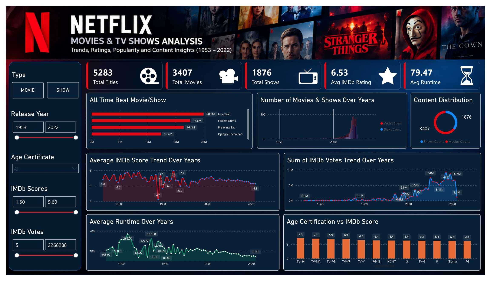

# Netflix Movies & TV Shows Analysis

**A Power BI dashboard exploring 5,283 Netflix titles (1953–2022) — trends, ratings, popularity and content insights.**



---

## Overview

This project analyses the Netflix catalogue to answer six business questions about content trends, ratings, popularity and age certification. The data was cleaned and transformed in **Power Query**, modelled and measured with **DAX**, and presented in an interactive **Power BI** report.

The goal is to demonstrate a complete analytics workflow — from raw data to a decision-ready dashboard — on a real-world dataset.

---

## Objectives

1. Which was the best movie and TV show overall in the last 50 years?
2. How many titles exist across the years — is the dataset skewed toward recent years?
3. On average, has the IMDb score improved or declined over the last 50 years?
4. Have more people started voting on IMDb over the last 50 years?
5. On average, how has the runtime changed over the last 50 years?
6. How does age certification affect a title's rating?

---

## Dataset

- **Rows:** 5,283 titles — 3,407 movies and 1,876 shows
- **Years covered:** 1953–2022
- **Fields:** `id`, `title`, `type`, `description`, `release_year`, `age_certification`, `runtime`, `imdb_score`, `imdb_votes`
- **Location in repo:** `Data/Netflix.xlsx`

---

## Tools

- **Power BI Desktop** — Power Query (data cleaning) and DAX (measures)
- **Microsoft Excel** — initial data inspection

---

## Repository Structure

```
Netflix-data-analysis/
├── Dashboard/        # Dashboard screenshot(s)
├── Data/             # Raw dataset (Netflix.xlsx)
├── Documentation/    # Project report, data dictionary
├── Workbook/         # Power BI file (.pbix)
└── README.md
```

---

## Data Cleaning (Power Query)

| Step | Action | Reason |
|------|--------|--------|
| 1 | Removed the `index` column | It is only a row number (0–5282), with no analytical value |
| 2 | Removed the `imdb_id` column | Unique reference code, never used in analysis |
| 3 | Added custom column `Rating_x_Votes = imdb_score × imdb_votes` | A high score from very few voters is unreliable, so score and votes are combined into one signal |
| 4 | Replaced `runtime = 0` with `null` | 18 shows had runtime recorded as 0 (missing per-episode length); nulling them keeps averages honest |
| 5 | Repaired corrupted text encoding in `title` and `description` | Accented characters were saved with the wrong encoding (e.g. "Pokémon" stored as "Pokémon") |
| 6 | Set correct data types | `release_year` / `runtime` / `imdb_votes` = Whole Number; `imdb_score` / `Rating_x_Votes` = Decimal |
| 7 | Left missing `age_certification` and `imdb_votes` as-is | No reliable way to infer them; rows still carry valid data elsewhere |

---

## Key DAX Measures

```dax
Total Titles    = DISTINCTCOUNT(Netflix[id])
Total Movies    = CALCULATE([Total Titles], Netflix[type] = "MOVIE")
Total Shows     = CALCULATE([Total Titles], Netflix[type] = "SHOW")
Avg IMDb Rating = AVERAGE(Netflix[imdb_score])
Avg Runtime     = AVERAGE(Netflix[runtime])
Total Votes     = SUM(Netflix[imdb_votes])
Best Rating x Votes = MAX(Netflix[Rating_x_Votes])
```

---

## Key Insights

1. **Best movie and show (by Rating × Votes):** *Inception* is the top movie (~19.96M) and *Breaking Bad* the top show (~16.4M).
2. **The dataset is heavily skewed to recent years:** 4,698 of 5,283 titles (about 89%) were released in 2010 or later; only 216 predate 2000. Any year-based conclusion must account for this.
3. **Average IMDb score has gently declined** over the decades — from about 7.1 in the 1950s to about 6.3 in the 2020s.
4. **Total IMDb votes rise sharply over time**, but this is largely driven by the growing number of titles rather than people voting more — so it is a weak insight on its own.
5. **Average runtime has fallen** — from about 130 minutes in the 1960s to about 75 minutes in the 2020s.
6. **Shows rate higher than movies** (average ~7.0 vs ~6.3). Among shows, **TV-14** is the highest-rated category; among movies, **PG-13** leads.

---

## How to Use

1. Clone or download this repository.
2. Open `Workbook/` in **Power BI Desktop** (requires Power BI Desktop, free from Microsoft).
3. If prompted, point the data source to `Data/Netflix.xlsx`.
4. Explore the dashboard using the slicers: **Type**, **Release Year**, **Age Certificate**, **IMDb Score** and **IMDb Votes**.

---

## Limitations & Data Quality Notes

- **Missing age certification:** 2,285 titles (~43%) have no certification. These are not a real category and are excluded from the certification analysis.
- **Missing votes:** 16 titles have no IMDb vote count; they are kept but excluded from vote-based visuals.
- **Partial final year:** 2022 is incomplete in the dataset, so recent-year totals are lower than a full year would show.
- **Skewed coverage:** the concentration of recent titles limits what can be concluded about early decades.
- **Duplicate titles:** 46 titles appear more than once — these are genuinely different titles with different ids (e.g. remakes), not duplicate records.

---

## Author

**Satyam Vishwakarma**
Email: skv.satyam002@gmail.com
